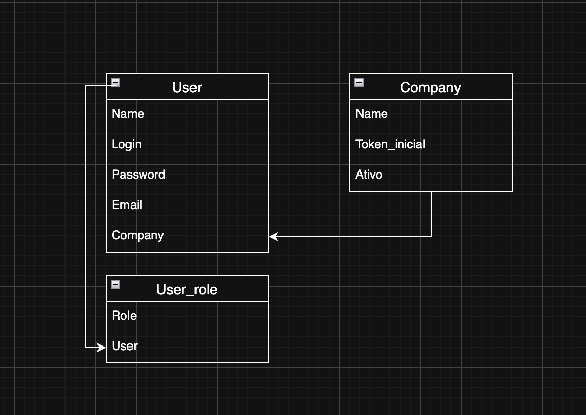

# Logpass
## Como rodar o projeto
- pip install -r req.txt // instale as dependências
- alembic upgrade head // rode as migrations

## Arquitetura do sistema

### Roles

    O sistema é orientado a roles (permissões), onde o usuário só tem acesso ao que é permitido para ele.

    São elas:
    - Suporte
        Permissão para usuários internos do LogPass. Clientes não tem acesso.
    - Admin
        Super usuário da empresa, pode criar outros usuários e acessar todas as funcionalidades.
    - Estoque
        Usuário responsável pelo estoque.
    - Financeiro
        Usuário responsável pelo financeiro.

### Empresa
    Os usuários são vinculados a uma empresa, dessa forma só possuem acesso a informações de sua própria compania.

### Ferramentas utilizadas
        Para criar o servidor foi utilizado o framework Flask. 
        Para o frontend foi utilizado o mini framework Alpine.js para adicionar reatividade ao frontend, junto com o framework tailwind.css para estilos. 
        O banco de dados utilizado foi postgres, junto com o CLI em python alembic para fazer migrations.
### Site map
    <urlset xmlns="http://www.sitemaps.org/schemas/sitemap/0.9">
    <url>
    <loc>http://localhost:5000/login/</loc>
    </url>
    <url>
    <loc>http://localhost:5000/login/logout</loc>
    </url>
    <url>
    <loc>http://localhost:5000/</loc>
    </url>
    <url>
    <loc>http://localhost:5000/configuracoes</loc>
    </url>
    <url>
    <loc>http://localhost:5000/usuarios</loc>
    </url>
    <url>
    <loc>http://localhost:5000/cadastro/</loc>
    </url>
    <url>
    <loc>http://localhost:5000/cadastro/ativar</loc>
    </url>
    <url>
    <loc>http://localhost:5000/sitemap.xml</loc>
    </url>
    </urlset>